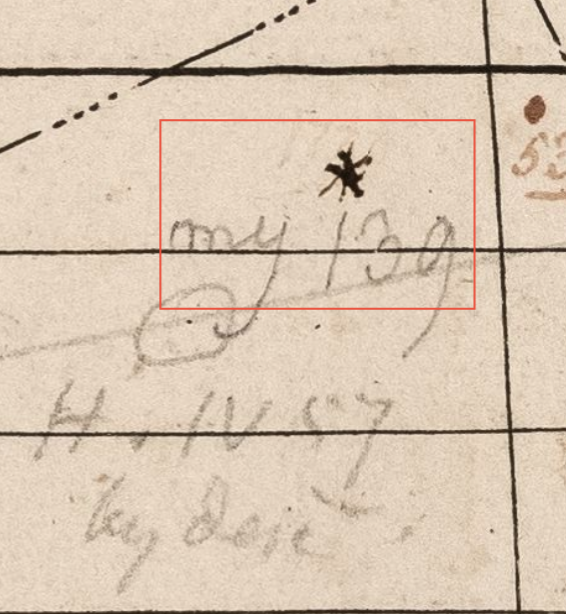
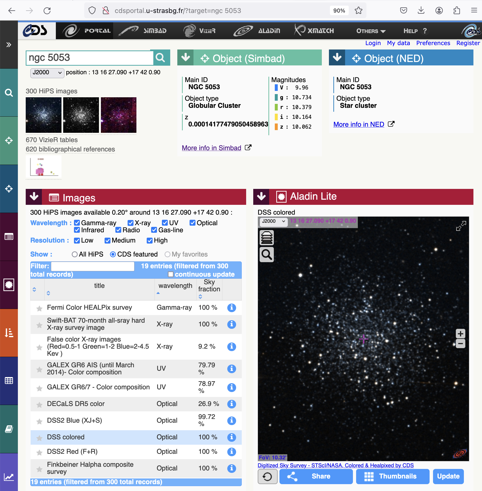

# goobi alterations/customizations

Goobi is fully customizable, as it's a flat xml database.

I've been futzing with it and found a few useful entry points. I will keep a journal of them here so as [not to quarrel with myself](https://books.google.com/books?id=_e89AAAAYAAJ&newbks=1&newbks_redir=0&printsec=frontcover&pg=PA32#v=onepage&q&f=false).

## Overview

I have been using the "other structure" type a bit aggressively in order to help accommodate the apparently novel use of METS with respect to scientific ontologies. 

Specifically, I'm working on a history of astronomy project that has a lot of linked data potential, but requires accommodation.

I'm therefore looking to expand the functionality of my ruleset to produce:

1. linked data
1. that references record authorities
1. and conforms to a controlled vocabulary

In general, that sounds anodyne, but the databases I'm talking about haven't generally been considered by archivists, who tend to focus on humanistic records -- or records humanistically.

## Record authorities

Record authorities allow for controlled linked data with important entities, like historical figures. VIAF (for persons) is perhaps the best-known of these, though D.O.I.'s would also qualify, I think (for publications/"digital objects").

### Project relevance

I need to point at astronomical record authorities in order to make Caroline and Williams' annotations of Flamsteed's Atlas, and their recordings of discoveries in their own notebooks, meaningful. This should be uncontroversial -- astronomical db's are very stable. This link has probably been viable for 20 years: http://simbad.u-strasbg.fr/simbad/sim-id?Ident=NGC%205053

#### Problem

I can't find a way to create a record authority that

1. applies to non-person entities
1. shows up in the viewer for non-person entities

And I don't know if this is doable without extra, external API tooling. It seems to me that I should be able to point at a URI -- and for me, as well as other, I assume, this would ideally happen on the page-region level. Consider the linked data possibilities of bibliographies.

#### Current state

I can see how to create a create a new record authority that Goobi will recognize: like so, in ```goobi/config/goobi_normdata.xml```.

	<?xml version="1.0" encoding="UTF-8"?>
	<normdatabases>
		<normdatabase name="GND" url="http://d-nb.info/gnd/" abbreviation="gnd" />
		<normdatabase name="geonames" url="http://www.geonames.org/" abbreviation="geonames" />
		<normdatabase name="viaf" url="http://www.viaf.org/viaf/" abbreviation="viaf" />
		<normdatabase name="simbad" url="http://simbad.u-strasbg.fr/simbad/" abbreviation="simbad" />
	</normdatabases>
	
However, these "norm databases" appear only to be picked up in goobi's person menu. As far as I can tell, that would block us from linking to:

1. Another document, even if it has a D.O.I. (in my case, old astronomy articles)
1. A non-person entity, even if it has a URI (in my case, deep-sky-objects in SIMBAD)

So I have to figure out where the hooks are that allow a "Person" object type to have access to these norm databases, or, more easily, find a way to add a link in the structures that will show up in the viewer. That is the ultimate goal, but I want to do it in a standards-based way.

## Custom DocTypes with linked data

Relevant to (but technically separable from) the above, it would seem useful to people other than myself to be able to create structural elements, in the "edit metadata" interface, that link to authoritative external resources.

## Problem

However, either due to some internal tooling in Goobi or some standards-based restrictions that I'm not understanding, I can't find an easy way to:

1. Create a "reference" DocType
	1. For instance when Caroline Herschel refers in a notebook to a published article
	1. Interestingly, astronomers have done a great job of digitizing their history
	1. We have D.O.I.'s for articles going way, way back
	1. But I can't figure out how to
		1. highlight the portion of the page where she makes the reference
		1. and link to that D.O.I.
1. Create an "annotation" DocType
	1. For instance, when William
		1. Draws a little asterisk in Flamsteed's Atlas
		1. And labels it "my 139"
		1. We know
			1. what it is: NGC 5053
			1. the earliest date this mark could have been made, as he discovered it
	1. I would therefore like to
		1. use SIMBAD as a record authority
		1. push hard links into this "annotation" DocType
		1. and have them show in the 
	1. It's worth noting that these "annotation" types
		1. are borrowing from the WC3 annotation standard
		1. which it looks like the page region module in goobi is perfectly suited to





### Current state

I've found some potential paths here, but they're not totally satisfying.

	<DocStrctType>
	<Name>Observation</Name>
	<language name="de">Überwachung</language>
	<language name="en">Observation</language>
	<language name="es">Observación</language>
	<metadata DefaultDisplay="true" num="*">Observer</metadata>
	<metadata num="1o" DefaultDisplay="true">datedigit</metadata>
	<allowedchildtype>Figure</allowedchildtype>
	<allowedchildtype>Reference</allowedchildtype>
	</DocStrctType>

For instance,

* I can
	* Create a custom document type like "Observation" that allows me to
		* represent the Herschels' documented astronomical observations
		* contain specific, relevant child types like
			* figures: they draw clusters all the time
			* references: they cite, in these figures and attendant texts,
				* known objects
				* contemporary catalogues that were in their time record authorities
	* Put a URN field in these structural element forms
* I cannot
	* Get that URN field to display in the viewer
	* Determine whether this is the best-practices way of doing this work
	
